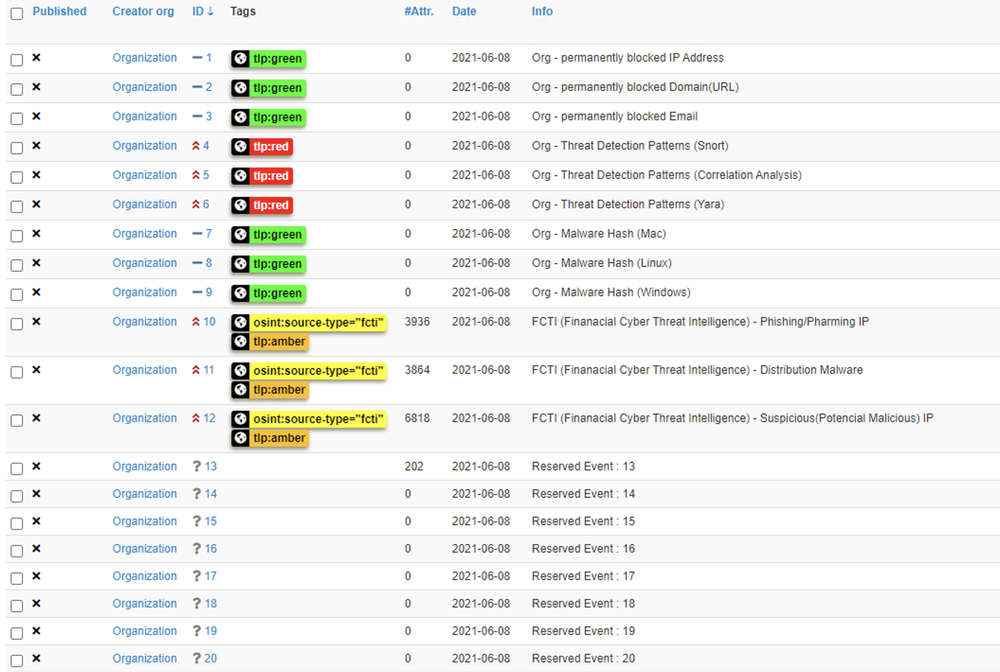
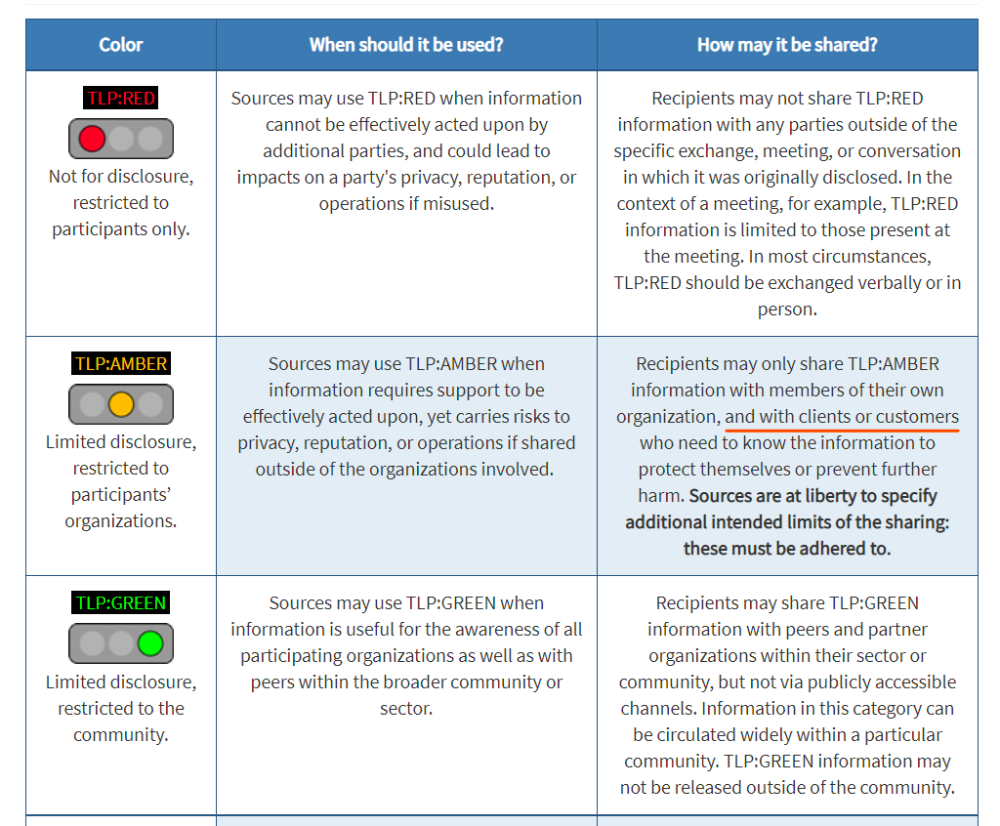

# Cyber Threat Intelligence (CTI)

Building and operating CTI (Cyber Threat Intelligence)

* Building and operating Threat Intelligence Platform (TIP)
* Prevention known cyber threat using CTI

## Build own Threat Intelligence Platform

Most commercial TIPs doesn't provide customized. (ex. add own threat intelligence)

This means you can only manage/use the threat intelligence they provide.

So, I thought we need own platform. The recommended platform are:

* [Malware Information Sharing Platform (MISP)](https://www.misp-project.org/)
* [OpenCTI](https://www.opencti.io/en/)

### Gathering Open-Source Intelligence (OSINT)

You can gather open-source intelligence from various channel.

It's provides in a standard (or not) form such as STIX/TAXII.

* [AlienVault](https://otx.alienvault.com/)
* [Feodo Tracker](https://feodotracker.abuse.ch/)
* [URLHaus](https://urlhaus.abuse.ch/)
* [EXPLOIT-DATABASE](https://www.exploit-db.com/)
* [National Vulnerability Management (NVD)](https://nvd.nist.gov/)

In addition, There are many types of commercial CTI services.

* [VirusTotal](https://www.virustotal.com)
* [SOC PRIME](https://socprime.com/)
* [S2W](https://s2w.inc/)
* [Ensign InfoSecurity](https://www.ensigninfosecurity.com/)
* [Financial Cyber Threat Intelligence (FCTI)]()
* [C-TAS](https://cshare.krcert.or.kr:8443/index)

### Malware Information Sharing Platform (MISP)

The use case below is described based on MISP.

#### Use Case #1. Create Reserved Event

We're gathering many types threat intelligence from various channel. and it will increase.

Therefore, flexibility should be taken into account when building a MISP.
For example, I created 100 reserved event and some define them like this:

#### Use Case #2. Traffic Light Protocol (TLP)
 
Why do we need TLP ? the answer is we don't want to publicly publish everything.

* [TRAFFIC LIGHT PROTOCOL](https://www.first.org/tlp/)

The Traffic Light Protocol (TLP) was created in order to facilitate greater sharing of information. TLP is a set of designations used to ensure that sensitive information is shared with the appropriate audience.

It just optimized for ease of adoption, human readability and person-to-person sharing.

You can use tags in MISP to specify the scope of the share.

Tagging is a simple way to attach a classification to an event in MISP.
After evaluating different solutions of classification, we build a new scheme using the concept of machine tags.

#### Use Case #3. Manage threat intelligence lifecycle
