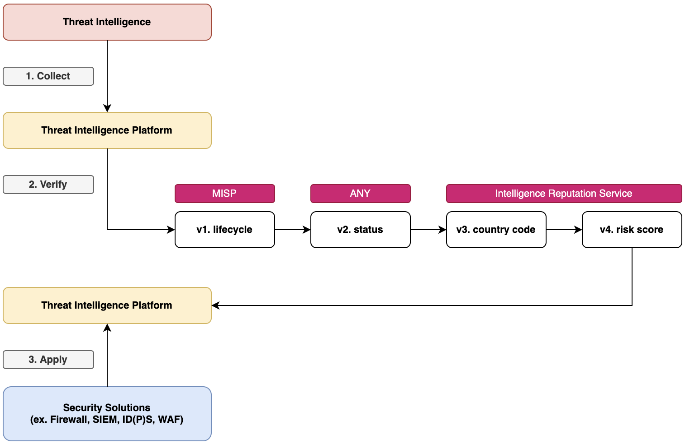

# 사이버 위협 인텔리전스 (CTI, Cyber Threat Intelligence)

사이버 위협 인텔리전스 (이하 CTI) 정의에 대해서, 가트너에서는 "현존하거나 발생 가능한 위협에 대응을 결정에 사용할 수 있도록 해당 위협에 대한 맥락(context), 메커니즘, 지표, 예상결과 및 실행가능한 조언 등을 포함하는 증거기반의 지식" 이라고 설명한다.

우리는 사이버 위협 인텔리전스를 활용해 새로운 위협 정보를 인지하고, 이를 통해 알려진 위협에 대해 선제적으로 대응할 수 있다.

여기서는 아래의 내용을 통해  

* 위협 인텔리전스 플랫폼 (TIP, Threat Intelligence Platform) 구축 및 운영
* 위협 인텔리전스를 활용한 알려진 위협 대응

<br>

## Threat Intelligence Platform (TIP) 구축 및 운영

위협 인텔리전스 플랫폼은 선제적 위협 대응을 위한 필수 요소이며, 위협 정보 공유를 통해 사이버 보안 사고를 신속하게 공유할 수 있다. 
가장 많이 활용되고 있는 TIP 로는 CIRCL 의 MISP, AlienVault 의 OTX, 국내에서는 KISA, FCTI 등이 있다.

위협 인텔리전스 플랫폼은 대체로 아래 그림과 같은 구조로 설계 및 구현되었으며, 핵심 기능은 다음과 같다.

* 위협 인텔리전스 수집 및 통합
* 기존 보안시스템과의 통합
* Threat Intelligence 분석 및 공유


<br>

대부분의 상업용 위협 인텔리전스 플랫폼에서는 커스텀 기능을 지원하지 않는다.
이 말인 즉슨, 플랫폼 제공 업체가 제공해주는 위협 인텔리전스를 제외한 조직 내부의 위협 인텔리전스는 별도로 관리해야한다.

그렇기 때문에 조직 내부에서 수 많은 위협 인텔리전스를 효율적으로 관리하기 사용하기 위한 플랫폼이 필요해진다.

개인적으로 추천하는 오픈소스 플랫폼은 다음과 같다.

* [Malware Information Sharing Platform (MISP)](https://www.misp-project.org/)
* [OpenCTI](https://www.opencti.io/en/)

<br>

### Open-Source Intelligence (OSINT) 수집

위협 인텔리전스가 없는 위협 인텔리전스 플랫폼은 껍데기에 불과하다. 

그렇기에 우리는 공개된 여러 채널을 활용해 위협 인텔리전스를 수집하거나 별도로 상용 CTI 서비스를 구매해야 한다.

* [AlienVault](https://otx.alienvault.com/)
* [Feodo Tracker](https://feodotracker.abuse.ch/)
* [URLHaus](https://urlhaus.abuse.ch/)
* [EXPLOIT-DATABASE](https://www.exploit-db.com/)
* [National Vulnerability Management (NVD)](https://nvd.nist.gov/)
* [MITRE ATT&CK](https://github.com/mitre/cti)

<br>

* [VirusTotal](https://www.virustotal.com)
* [SOC PRIME](https://socprime.com/)
* [S2W](https://s2w.inc/)
* [Ensign InfoSecurity](https://www.ensigninfosecurity.com/)
* [Financial Cyber Threat Intelligence (FCTI)]()
* [C-TAS](https://cshare.krcert.or.kr:8443/index)
* [RiskIQ](https://www.riskiq.com/)
* [CUDESO](https://www.cudeso.be/index.html)

<br>

### Malware Information Sharing Platform (MISP)

MISP 시스템을 효과적으로 사용하기 위해 고민하고 활용한 방법을 설명한다.

<br>

#### Use Case #1. 예약 이벤트 생성

만약 단일 CTI 서비스를 사용해 위협 인텔리전스를 수집하고 활용하는 것이 아니라면, 이는 계속해서 증가할 확률이 높다.

API 활용한 자동화 운영 및 관리의 편의성을 위해 사전에 예약 이벤트를 생성하고, 위협 인텔리전스 수집 채널 및 타입 별로 구분하여 이벤트를 생성한다. (하단 이미지 참조)

예를 들어, 100개의 예약 이벤트를 생성했다면, ID 값 100 이후에는 내부적으로 보안사고 또는 공격 캠페인 용도로 사용한다.


<br>

#### Use Case #2. 신호등 프로토콜 (TLP, Traffic Light Protocol)

"신호등 프로토콜은 왜 필요한가?" 라는 질문에 대답은, 우리는 모든 정보를 공유하고 싶지 않기 때문이다.

신호등 프로토콜은 정보 공유를 용이하게 하기 위한 목적으로 만들어졌으며, 민감한 정보에 대한 공유범위를 지정하여 사용할 수 있다.

* [TRAFFIC LIGHT PROTOCOL](https://www.first.org/tlp/)


이러한 공유범위 지정은 강제사항이 아니며, 채택의 용이성과 가독성 및 개인 간의 공유를 위해 최적화되었다.

MISP 시스템에서도 마찬가지로 태그를 활용해 공유범위를 지정할 수 있다.  


<br>

#### Use Case #3. 위협 인텔리전스 수명주기 관리

일부 위협 인텔리전스 (ex. IP, Domain) 에 대해서는 주기적으로 관리 (필요에 따라 삭제) 가능해야 한다. 
만약 위협 인텔리전스 수명 주기 관리를 하지 않는다면, 정보를 활용하는 과정에서 오탐으로 인해 정상적인 서비스가 동작하지 않을 수 있다.

이를 위해 MISP 시스템에서는 기본적으로 위협 인텔리전스 수명주기 모델과 함께 분류(Taxonomies), 은하(Galaxies) 기능을 제공한다.

또한, 위와 같은 모델이나 추가 가중치 정보들에 대해 사용자 정의가 가능하다.

* [Decaying of Indicators](https://www.misp-project.org/2019/09/12/Decaying-Of-Indicators.html/)

<br>

##### 3-1. The (potentially) annoying bits of the theory

수명주기는 `base_score` 와 `score` 라는 두 가지 컴포넌트를 기반으로 한다. 

IoC 의 품질과 시간이 지남에 따라 감소하는 시간 종속 점수를 고려해 base_score 라는 초기 고정값을 갖는다.

단순화된 버전은 다음과 같다.

```text
score = base_score * P
```

`P` 는 다음 매개 변수로 구성된다.
* 수명 (lifetime) : IoC 수명 또는 속성의 점수가 0 에 도달하는 시점
* 수명 감쇠 속도 (decay_speed) : 감쇠가 발생하는 속도 또는 속성이 점수를 잃는 속도

*만약, 특정 속성에 대해 Sightings 가 추가될 때마다 점수는 base_score 로 고쳐지며, 새로운 지점에서 감소가 시작된다.*

<br>

##### 3-2. Polynomial Decaying Model built-in in MISP

base_score 는 다양한 첨부 가중치와 함께 분류(Taxonomies) 내용을 기준으로 계산된다. 

가중치는 분류 항목 내에서 추출한 숫자 값을 다른 것보다 우선시하는 수단이다.

phishing 네임스페이스를 예시로 한 내용은 다음과 같다. (numerical_value 포함)

* admiraly-scale:source-reliability = Completely reliable, numerical_value = 100
* admiraly-scale:source-reliability = Not usually reliable, numerical_value = 25
* phishing:psychological-acceptability = high, numerical_value = 75

단일 태그 (ex. admiraly-scale:source-reliability = Completely reliable) 만 첨부된 경우 base_score 는 다음과 같다.
```text
base_score = 100
```

가중치는 속성에 따라 여러 태그가 첨부될 때 동작한다. 만약 두 분류가 속성 점수와 관련하여 동일한 중요성을 가져야 한다고 가정한다. 
따라서, 총 가중치(100)가 공유되어 각 분류마다 가중치(5)을 할당한다.

다중 태그 (ex. admiraly-scale:source-reliability = Completely reliable, phishing:psychological-acceptability = high, numerical_value = 75) 일 때 base_score 는 다음과 같다.
```text
admiraly-scale:source-reliability = Completely reliable (0.50 * 100.00 = 50.00)
phishing:psychological-acceptability = high, numerical_value = 75 (0.50 * 75.00 = 37.50)

result : base_score = 87.50 
```

<br>

#### Use Case #4. Automation API

위협 인텔리전스 플랫폼을 운영하면, 많은 정보가 추가되고 또 삭제 및 검색되는 작업이 빈번하게 일어난다.

다른 업무를 수행하면서 이러한 작업들을 수동으로 하는 것은 사실상 불가능에 가깝다. 
다행스럽게도 MISP 에서는 자동화를 위한 API 및 파이썬 모듈을 아래와 같이 제공한다. 아래의 정보를 참조해 조직에서 원하는 형태로 자동화 운영 가능하다.

* [Automation and MISP API](https://www.circl.lu/doc/misp/automation/#automation-api)
* [PyMISP](https://github.com/MISP/PyMISP)

<br>

추가로, [MISP OpenAPI Spec](https://www.misp-project.org/openapi/) 을 제공한다.

<br>

## 위협 인텔리전스 활용한 알려진 위협 대응

앞에서는 위협 인텔리전스를 수집하고 효과적으로 운영하기 위한 여러 활용 사례들을 설명했다.

조직에서 위협 인텔리전스를 활용한 알려진 위협에 대응하기 위한 대략적으로 프로세스는 다음과 같다.



<br>

각각의 작업에 대해 조금 더 설명을 덧붙이자면,

**[1] 위협 인텔리전스 수집** 단계 에서는, 조직에서 신뢰하는 공개된 위협 인텔리전스를 수집하거나 조직에 적합한 상용 위협 인텔리전스 서비스를 도입할 수 있다. 
만약 OSINT 를 활용한다면 예산을 절감할 수 있다는 장점이 있지만, 실무자 입장에서 신뢰할 수 있는 서비스인지 검토하고 각각의 OSINT 서비스마다 제공 정보를 수집/가공하기 위해서 자동화하는 등 별도 작업이 필요하다.

**[2] 위협 인텔리전스 검증** 단계 에서는, 어떠한 형태로 위협 인텔리전스를 수집하더라도 이를 검증하는 작업이 필요하다.
그 이유는 (In-line 구성으로 보안 솔루션을 운영한다고 가정했을 때, 미검증된 위협 인텔리전스는 서비스의 가용성을 침해할 가능성이 있다.
검증의 기준은 조직마다 다르겠지만, 개인적으로 조직에 활용한 기준은 `Lifetime`, `Country`, `Risk Score` 이다.

* Lifetime : 위협 인텔리전스 수명
* Country : 위협 (IP/Domain) 국가정보
* Risk Score : 위험 점수


**[3] 위협 인텔리전스 업데이트** 단계 에서는, [2] 에서 검증된 위협 인텔리전스를 내부에서 운영하는 웹 서버 (ex. nginx, apache) 또는 TAXII 서버로 업데이트하는 작업이다.

**[4] 위협 인텔리전스 적용** 단계 에서는, 보안솔루션에서 웹 또는 TAXII 서버에 업데이트된 검증이 완료된 위협 인텔리전스를 적용하는 작업이다.
(구성 환경에 따라 방화벽 오픈 작업이 필요할 수 있다.)

<br>

## 참고

* [Introduction to STIX](https://oasis-open.github.io/cti-documentation/stix/intro)
* [Introduction to TAXII](https://oasis-open.github.io/cti-documentation/taxii/intro.html)
* [TAXII Version 2.0](https://docs.oasis-open.org/cti/taxii/v2.0/taxii-v2.0.html)
* [TAXII Version 2.1](https://docs.oasis-open.org/cti/taxii/v2.1/cs01/taxii-v2.1-cs01.html#_Toc31107530)
* [OASIS Repositories](https://github.com/oasis-open)
